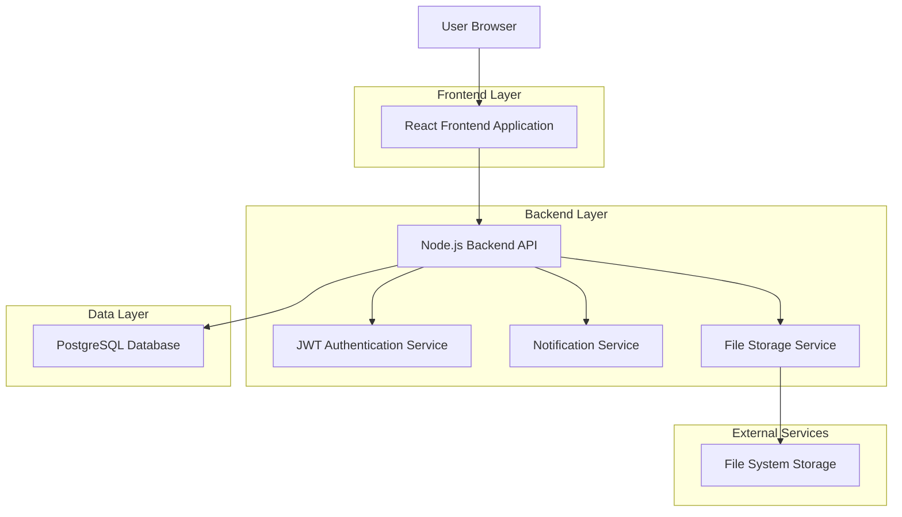
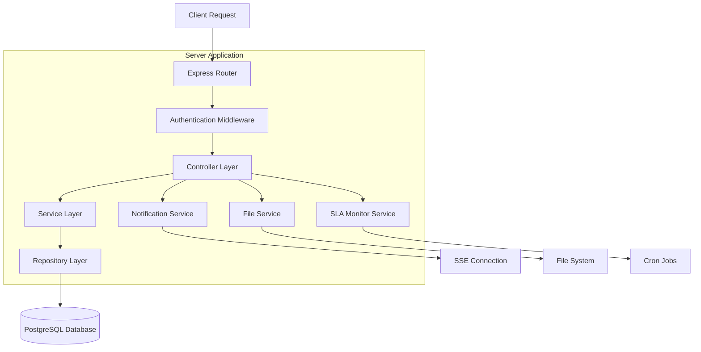
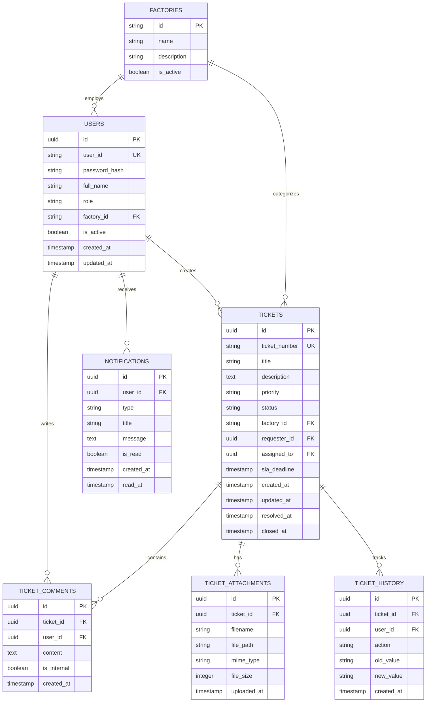

# HIT Ticket Management System - Technical Architecture Document

## 1. Architecture Design



## 2. Technology Description

- **Frontend:** React@18 + TypeScript + Tailwind CSS + Vite + React Router + Axios
- **Backend:** Node.js@18 + Express@4 + TypeScript + JWT + Multer + Node-cron
- **Database:** PostgreSQL@15 + Sequelize ORM
- **Authentication:** JWT (JSON Web Tokens)
- **File Storage:** Local file system with organized directory structure
- **Notifications:** Server-sent events (SSE) for real-time popup notifications

## 3. Route Definitions

| Route | Purpose |
|-------|---------|
| / | Dashboard page, displays ticket overview and notifications |
| /login | Authentication page using User ID and password |
| /tickets/create | Ticket creation form with factory and priority selection |
| /tickets | Ticket management page with filtering and assignment |
| /tickets/:id | Ticket details page with communication thread and SLA tracking |
| /users | User management page for admin role |
| /reports | Analytics dashboard with performance metrics |
| /notifications | Notification center for managing alerts and messages |
| /profile | User profile page with factory associations |

## 4. API Definitions

### 4.1 Core API

**Authentication**
```
POST /api/auth/login
```

Request:
| Param Name | Param Type | isRequired | Description |
|------------|------------|------------|-------------|
| userId | string | true | Organization-assigned User ID |
| password | string | true | User password |

Response:
| Param Name | Param Type | Description |
|------------|------------|-------------|
| success | boolean | Authentication status |
| token | string | JWT token for session |
| user | object | User information and permissions |

Example:
```json
{
  "userId": "HIT001234",
  "password": "securePassword123"
}
```

**Ticket Management**
```
POST /api/tickets
GET /api/tickets
GET /api/tickets/:id
PUT /api/tickets/:id
DELETE /api/tickets/:id
```

**User Management**
```
GET /api/users
POST /api/users
PUT /api/users/:id
DELETE /api/users/:id
```

**Notifications**
```
GET /api/notifications
POST /api/notifications
PUT /api/notifications/:id/read
```

**Reports**
```
GET /api/reports/dashboard
GET /api/reports/sla-compliance
GET /api/reports/agent-performance
```

**File Upload**
```
POST /api/upload
GET /api/files/:id
```

## 5. Server Architecture Diagram



## 6. Data Model

### 6.1 Data Model Definition



### 6.2 Data Definition Language

**Users Table**
```sql
-- Create users table
CREATE TABLE users (
    id UUID PRIMARY KEY DEFAULT gen_random_uuid(),
    user_id VARCHAR(50) UNIQUE NOT NULL,
    password_hash VARCHAR(255) NOT NULL,
    full_name VARCHAR(100) NOT NULL,
    role VARCHAR(20) NOT NULL CHECK (role IN ('employee', 'support_staff', 'admin', 'manager')),
    factory_id VARCHAR(10) REFERENCES factories(id),
    is_active BOOLEAN DEFAULT true,
    created_at TIMESTAMP WITH TIME ZONE DEFAULT NOW(),
    updated_at TIMESTAMP WITH TIME ZONE DEFAULT NOW()
);

-- Create index
CREATE INDEX idx_users_user_id ON users(user_id);
CREATE INDEX idx_users_factory_id ON users(factory_id);
CREATE INDEX idx_users_role ON users(role);
```

**Factories Table**
```sql
-- Create factories table
CREATE TABLE factories (
    id VARCHAR(10) PRIMARY KEY,
    name VARCHAR(100) NOT NULL,
    description TEXT,
    is_active BOOLEAN DEFAULT true
);

-- Insert initial factory data
INSERT INTO factories (id, name, description) VALUES
('ARDIC', 'Armament Research & Development and Integration Center', 'Research and development facility'),
('GUNFACTORY', 'Gun Factory', 'Artillery and weapons manufacturing'),
('ASRC', 'Ammunition Storage and Refurbishment Center', 'Ammunition storage and maintenance'),
('HRF', 'Heavy Rebuild Factory', 'Tank and vehicle rebuild operations'),
('MVF', 'Military Vehicle Factory', 'Military vehicle manufacturing'),
('HITEC', 'HIT Engineering Complex', 'Engineering and technical services');
```

**Tickets Table**
```sql
-- Create tickets table
CREATE TABLE tickets (
    id UUID PRIMARY KEY DEFAULT gen_random_uuid(),
    ticket_number VARCHAR(20) UNIQUE NOT NULL,
    title VARCHAR(200) NOT NULL,
    description TEXT NOT NULL,
    priority VARCHAR(10) NOT NULL CHECK (priority IN ('low', 'medium', 'high', 'critical')),
    status VARCHAR(15) NOT NULL DEFAULT 'new' CHECK (status IN ('new', 'open', 'pending', 'on_hold', 'escalated', 'resolved', 'closed')),
    factory_id VARCHAR(10) NOT NULL REFERENCES factories(id),
    requester_id UUID NOT NULL REFERENCES users(id),
    assigned_to UUID REFERENCES users(id),
    sla_deadline TIMESTAMP WITH TIME ZONE,
    created_at TIMESTAMP WITH TIME ZONE DEFAULT NOW(),
    updated_at TIMESTAMP WITH TIME ZONE DEFAULT NOW(),
    resolved_at TIMESTAMP WITH TIME ZONE,
    closed_at TIMESTAMP WITH TIME ZONE
);

-- Create indexes
CREATE INDEX idx_tickets_ticket_number ON tickets(ticket_number);
CREATE INDEX idx_tickets_status ON tickets(status);
CREATE INDEX idx_tickets_priority ON tickets(priority);
CREATE INDEX idx_tickets_factory_id ON tickets(factory_id);
CREATE INDEX idx_tickets_requester_id ON tickets(requester_id);
CREATE INDEX idx_tickets_assigned_to ON tickets(assigned_to);
CREATE INDEX idx_tickets_created_at ON tickets(created_at DESC);
```

**Ticket Comments Table**
```sql
-- Create ticket_comments table
CREATE TABLE ticket_comments (
    id UUID PRIMARY KEY DEFAULT gen_random_uuid(),
    ticket_id UUID NOT NULL REFERENCES tickets(id) ON DELETE CASCADE,
    user_id UUID NOT NULL REFERENCES users(id),
    content TEXT NOT NULL,
    is_internal BOOLEAN DEFAULT false,
    created_at TIMESTAMP WITH TIME ZONE DEFAULT NOW()
);

-- Create indexes
CREATE INDEX idx_ticket_comments_ticket_id ON ticket_comments(ticket_id);
CREATE INDEX idx_ticket_comments_created_at ON ticket_comments(created_at DESC);
```

**Ticket Attachments Table**
```sql
-- Create ticket_attachments table
CREATE TABLE ticket_attachments (
    id UUID PRIMARY KEY DEFAULT gen_random_uuid(),
    ticket_id UUID NOT NULL REFERENCES tickets(id) ON DELETE CASCADE,
    filename VARCHAR(255) NOT NULL,
    file_path VARCHAR(500) NOT NULL,
    mime_type VARCHAR(100),
    file_size INTEGER,
    uploaded_at TIMESTAMP WITH TIME ZONE DEFAULT NOW()
);

-- Create index
CREATE INDEX idx_ticket_attachments_ticket_id ON ticket_attachments(ticket_id);
```

**Ticket History Table**
```sql
-- Create ticket_history table
CREATE TABLE ticket_history (
    id UUID PRIMARY KEY DEFAULT gen_random_uuid(),
    ticket_id UUID NOT NULL REFERENCES tickets(id) ON DELETE CASCADE,
    user_id UUID NOT NULL REFERENCES users(id),
    action VARCHAR(50) NOT NULL,
    old_value TEXT,
    new_value TEXT,
    created_at TIMESTAMP WITH TIME ZONE DEFAULT NOW()
);

-- Create indexes
CREATE INDEX idx_ticket_history_ticket_id ON ticket_history(ticket_id);
CREATE INDEX idx_ticket_history_created_at ON ticket_history(created_at DESC);
```

**Notifications Table**
```sql
-- Create notifications table
CREATE TABLE notifications (
    id UUID PRIMARY KEY DEFAULT gen_random_uuid(),
    user_id UUID NOT NULL REFERENCES users(id) ON DELETE CASCADE,
    type VARCHAR(30) NOT NULL,
    title VARCHAR(200) NOT NULL,
    message TEXT NOT NULL,
    is_read BOOLEAN DEFAULT false,
    created_at TIMESTAMP WITH TIME ZONE DEFAULT NOW(),
    read_at TIMESTAMP WITH TIME ZONE
);

-- Create indexes
CREATE INDEX idx_notifications_user_id ON notifications(user_id);
CREATE INDEX idx_notifications_is_read ON notifications(is_read);
CREATE INDEX idx_notifications_created_at ON notifications(created_at DESC);
```

**Initial Admin User**
```sql
-- Insert initial admin user
INSERT INTO users (user_id, password_hash, full_name, role, factory_id) VALUES
('HIT000001', '$2b$10$example_hash_here', 'System Administrator', 'admin', 'HRF');
```

**SLA Configuration Function**
```sql
-- Function to calculate SLA deadline based on priority
CREATE OR REPLACE FUNCTION calculate_sla_deadline(priority_level VARCHAR)
RETURNS INTERVAL AS $$
BEGIN
    CASE priority_level
        WHEN 'critical' THEN RETURN INTERVAL '2 hours';
        WHEN 'high' THEN RETURN INTERVAL '8 hours';
        WHEN 'medium' THEN RETURN INTERVAL '24 hours';
        WHEN 'low' THEN RETURN INTERVAL '72 hours';
        ELSE RETURN INTERVAL '24 hours';
    END CASE;
END;
$$ LANGUAGE plpgsql;

-- Trigger to set SLA deadline on ticket creation
CREATE OR REPLACE FUNCTION set_sla_deadline()
RETURNS TRIGGER AS $$
BEGIN
    NEW.sla_deadline := NEW.created_at + calculate_sla_deadline(NEW.priority);
    RETURN NEW;
END;
$$ LANGUAGE plpgsql;

CREATE TRIGGER trigger_set_sla_deadline
    BEFORE INSERT ON tickets
    FOR EACH ROW
    EXECUTE FUNCTION set_sla_deadline();
```