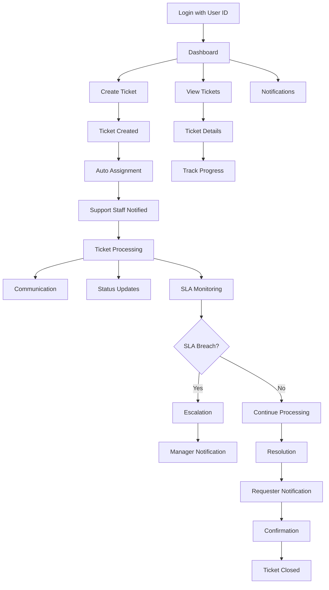

# HIT Ticket Management System - Product Requirements Document

## 1. Product Overview

A comprehensive Ticket Management System designed for Heavy Industries Taxila (HIT) to streamline issue reporting, tracking, and resolution across multiple production facilities. <mcreference link="https://hit.gov.pk/" index="0">0</mcreference>

The system addresses the unique operational constraints of a military industrial complex where electronic devices are restricted, utilizing User IDs for authentication and popup notifications for communication. It serves HIT's six major production units including ARDIC, Gun Factory, and ASRC, enabling efficient workflow management from ticket creation to closure.

Target: Improve operational efficiency by 40% and reduce average resolution time by 30% across all HIT facilities.

## 2. Core Features

### 2.1 User Roles

| Role | Registration Method | Core Permissions |
|------|---------------------|------------------|
| Employee | Organization-assigned User ID | Create tickets, view own tickets, receive notifications |
| Support Staff | Organization-assigned User ID + role assignment | Handle assigned tickets, update status, communicate with requesters |
| Admin | Organization-assigned User ID + admin privileges | Full system access, user management, reporting, system configuration |
| Manager | Organization-assigned User ID + manager role | View team performance, escalation handling, approve closures |

### 2.2 Feature Module

Our HIT Ticket Management System consists of the following main pages:

1. **Dashboard**: Ticket overview, notifications panel, quick actions, performance metrics
2. **Ticket Creation**: Issue submission form, factory selection, priority setting, attachment upload
3. **Ticket Management**: Ticket list, filtering, assignment, status updates, internal notes
4. **Ticket Details**: Complete ticket information, communication thread, resolution tracking, SLA monitoring
5. **User Management**: User profiles, role assignment, factory associations, access control
6. **Reports & Analytics**: Performance dashboards, SLA compliance, ticket statistics, agent performance
7. **Notifications Center**: Popup message management, alert configuration, escalation notifications

### 2.3 Page Details

| Page Name | Module Name | Feature Description |
|-----------|-------------|---------------------|
| Dashboard | Overview Panel | Display ticket counts by status, priority alerts, SLA breach warnings, recent activities |
| Dashboard | Notification Center | Show popup notifications, system alerts, assignment notifications, escalation warnings |
| Dashboard | Quick Actions | Create new ticket, search tickets, view assigned tickets, access reports |
| Ticket Creation | Submission Form | Capture ticket details (title, description, factory, priority), auto-generate ticket ID, timestamp creation |
| Ticket Creation | Factory Selection | Select from ARDIC, Gun Factory, ASRC facilities, categorize by department, set location context |
| Ticket Creation | Attachment Handler | Upload screenshots, documents, images, validate file types, manage file storage |
| Ticket Management | Ticket List | Display all tickets with filters (status, priority, factory, date range), pagination, sorting |
| Ticket Management | Assignment System | Round-robin distribution, skill-based routing, manual assignment, workload balancing |
| Ticket Management | Status Control | Update ticket status (New, Open, Pending, On Hold, Escalated, Resolved, Closed) |
| Ticket Details | Information Display | Show complete ticket data, requester details, assignment history, time tracking |
| Ticket Details | Communication Thread | Enable comments between requester and support, internal notes, status change logs |
| Ticket Details | SLA Monitoring | Track response time, resolution deadlines, escalation triggers, compliance status |
| User Management | Profile Management | Manage user information, factory associations, role assignments, access permissions |
| User Management | Authentication | User ID-based login, JWT token management, session control, security validation |
| Reports & Analytics | Performance Dashboard | Show resolution metrics, SLA compliance rates, ticket volume trends, agent statistics |
| Reports & Analytics | Factory Analytics | Factory-wise ticket distribution, performance comparison, resource utilization |
| Notifications Center | Popup Management | Send/receive popup notifications, alert configuration, escalation messaging |
| Notifications Center | Alert System | SLA breach alerts, assignment notifications, resolution confirmations, system announcements |

## 3. Core Process

**Employee Flow:**
1. Employee logs in using organization User ID
2. Creates ticket via web form, selects factory and priority
3. Receives acknowledgment with ticket number and SLA timeline
4. Tracks progress through ticket details page
5. Receives popup notifications for updates
6. Confirms resolution and provides feedback

**Support Staff Flow:**
1. Support staff receives assignment notification
2. Reviews ticket details and begins investigation
3. Communicates with requester through comment system
4. Updates status and adds internal notes
5. Collaborates with other departments if needed
6. Provides solution and marks as resolved
7. Handles escalation if SLA is breached

**Admin Flow:**
1. Admin monitors overall system performance
2. Manages user roles and permissions
3. Configures SLA parameters and escalation rules
4. Reviews reports and analytics
5. Handles system configuration and maintenance

## 4. User Interface Design

### 4.1 Design Style

- **Primary Colors:** HIT Corporate Blue (#1B365D), Military Green (#2D5016)
- **Secondary Colors:** Warning Orange (#FF8C00), Success Green (#28A745), Error Red (#DC3545)
- **Button Style:** Rounded corners (8px radius), solid fills with hover effects
- **Font:** Roboto for headings (16-24px), Open Sans for body text (14-16px)
- **Layout Style:** Card-based design with top navigation, sidebar for quick access
- **Icons:** Military-themed icons, industrial symbols, status indicators with color coding
- **Logo Integration:** HIT logo prominently displayed in header with organizational branding

### 4.2 Page Design Overview

| Page Name | Module Name | UI Elements |
|-----------|-------------|-------------|
| Dashboard | Overview Panel | Grid layout with metric cards, color-coded status indicators, progress bars for SLA tracking |
| Dashboard | Notification Center | Popup overlay with notification list, priority-based color coding, dismiss/action buttons |
| Ticket Creation | Submission Form | Multi-step form with validation, factory dropdown with icons, priority radio buttons, file upload area |
| Ticket Management | Ticket List | Data table with sorting, filtering sidebar, status badges, priority indicators, action buttons |
| Ticket Details | Information Display | Two-column layout, ticket header with key info, tabbed sections for details/comments/history |
| User Management | Profile Management | Form-based interface, role selection dropdown, factory association checkboxes, permission matrix |
| Reports & Analytics | Performance Dashboard | Chart.js integration, KPI cards, date range picker, export functionality, drill-down capabilities |
| Notifications Center | Popup Management | Modal dialogs, toast notifications, alert banners, notification history list |

### 4.3 Responsiveness

Desktop-first design optimized for workstation use in industrial environment. Mobile-adaptive for tablet access in field operations. Touch interaction optimization for industrial touchscreen terminals with larger button sizes (minimum 44px) and simplified navigation for ease of use with work gloves.